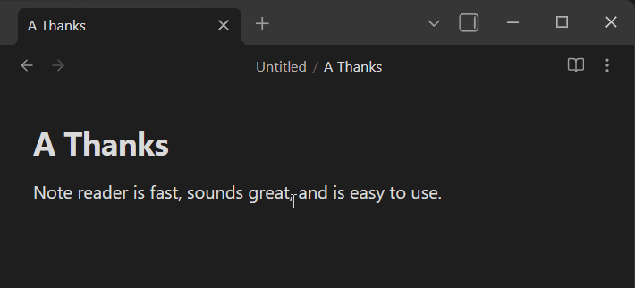
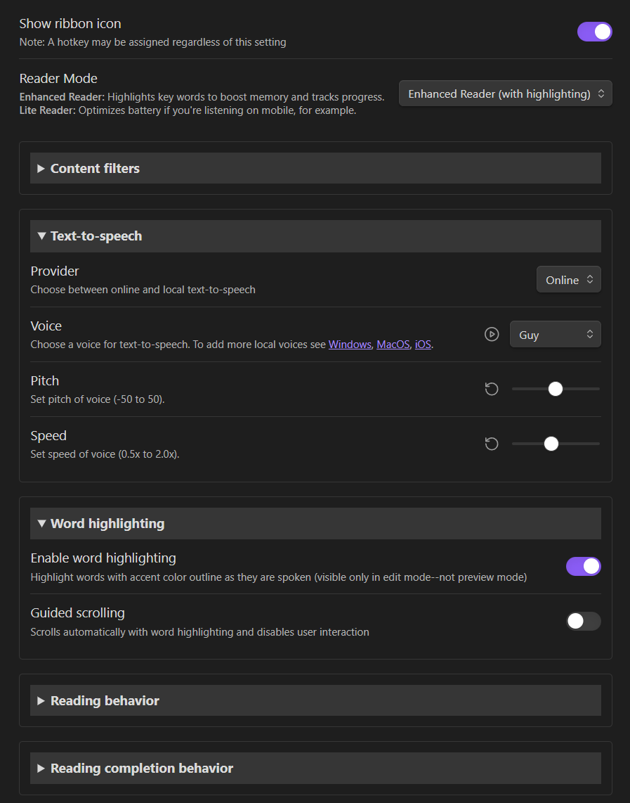

# Note Reader Plugin

## Purpose

Turn your notes (or articles via Obsidian Web Clipper) into an immersive audio experience with advanced text-to-speech technology. The plugin supports both online and on-device TTS, offering high-quality, customizable voices, adjustable playback controls, and real-time word highlighting to make reviewing content easier, more accessible, and more engaging.

## Table of Contents

- [Purpose](#purpose)
- [Features](#features)
- [Installation](#how-to-install-the-plugin)
- [Usage](#using-note-reader-read-note-command)
- [Settings](#settings)
- [Commands](#commands)
- [Screenshots](#screenshots)
- [Support and Contributing](#support-and-contributing)
- [Data Security](#data-security)

## Features

### Player

- **Text-to-Speech**: Read notes aloud using online or local system voices.
- **Controls**: Play/Pause, Rewind 10 seconds, Read active note, Close player.
- **Progress**: Shows playback progress with seamless chunked audio (Enhanced mode only).
- **Modes**: Enhanced (full features with highlighting) or Lite (CPU-optimized, no highlighting).
- **Ribbon Icon**: Optional icon for quick access.

### Text Processing

- **Content Filtering**: Removes frontmatter, code blocks, tables, headers, inline code, tags, URLs, images, emojis, highlights, asterisks, underscores.
- **Phrase Filtering**: Exclude lines with custom phrases or stop reading on specific phrases.
- **File Name Announcement**: Optionally announce file name before content.

### Highlighting

- **Word Highlighting**: Real-time highlighting of spoken words (edit mode only). Research supports word-by-word highlighting for [reading comprehension](https://pmc.ncbi.nlm.nih.gov/articles/PMC7959096/).
- **Guided Scrolling**: Auto-scroll with highlighting, disables user interaction.
- **Auto-Clear**: Clears highlights on stop.

### Audio

- **Completion Chime**: Configurable chime on finish.

## How to install the plugin

1. **Community Plugins Store (not yet available)**: Open Obsidian, go to Settings → Community plugins → Browse, and search for "Note Reader". Click Install and then Enable.
2. **Manual Installation**: Download the plugin files (`main.js`, `manifest.json`, `styles.css`) from the plugin's GitHub repository. Create a new folder in your Obsidian vault's plugins directory (e.g., `.obsidian/plugins/note-reader`), place the files there, and enable the plugin in Settings → Community plugins.

## Using Note Reader: Read note command

1. Open a Note: Open the note you want to listen to.
2. Assign a Hotkey (Recommended): Go to Settings -> Hotkeys and search for "note reader" to find the command. Assign a hotkey to "Read note".
3. Run the Command: Trigger the "Read note" command (via hotkey, ribbon icon, or Command Palette). The player appears at the top of the current pane and displays a loading spinner before reading starts.
4. Control Playback:
   - Play/Pause: Toggle playback.
   - Rewind: Jump back 10 seconds.
   - Read Active Note: Switch playback to the currently active note.
   - Close: Stop playback and remove the player.
5. Switch to Active Note: If you switch to another note while listening, use the "Read active note" button to switch playback to the active note; the UI updates to a Loading state immediately while preparing audio.

## Settings

### Reader Mode

- Choose between Enhanced (with highlighting) or Lite (CPU optimized).

### Content Filters

- Ignore YAML frontmatter, fenced code blocks, inline code, tags, headers, tables, highlights, images, links, emojis, asterisks, underscores, backslash escapes.
- Phrase-based filtering: Ignore lines with specific phrases.

### Text-to-Speech

- Provider: Online TTS or local system TTS.
- Voice: Select from available voices.
- Pitch: Adjust from -50 to 50 Hz.
- Speed: Adjust from 0.5x to 2.0x.

### Word Highlighting

- Enable highlighting during playback.
- Guided scrolling: Auto-scroll with highlighting.

### Reading Behavior

- Read file name before document.
- Behavior on repeated commands: Pause/play, stop/start, reload.

### Completion Behavior

- Play chime on finish.
- Auto-close player on completion.
- Stop on specific phrase.

### Troubleshooting

- Buffer ahead target.
- Auto-read on load.
- Debug logging.

### Statistics

- View and reset usage counters.

## Commands

- **Read note**: Reads the active note.
- **Read selected text**: Reads selected text or active note if none selected.
- **Restart playback**: Restarts from beginning.
- **Rewind 10 seconds**: Rewinds by 10 seconds.
- **Toggle (pause or play)**: Toggles play/pause.
- **Close playback bar**: Closes the player.

## Screenshots

### Playback Demo

Shows the player in action with controls, progress bar, and highlighting.

### Settings Panel

Plugin settings showing reader mode, content filters, TTS options, highlighting, and other configuration settings.

## Support and Contributing

For support, please check the [GitHub repository](https://github.com/mudnug/note-reader) for issues and discussions.

## Data Security

The system has two modes:

- **Local mode**: Uses the browser's Web Speech API (speechSynthesis) for client-side TTS, processing everything locally without sending data to external servers.
- **Online mode**: Uses Azure Cognitive Services via the Edge TTS library, which sends text and a token to Microsoft servers for processing, with encrypted transfers and immediate deletion of data. See their [data policy](https://learn.microsoft.com/en-us/azure/ai-foundry/responsible-ai/speech-service/text-to-speech/data-privacy-security?tabs=custom-neural-voice) for more details.
