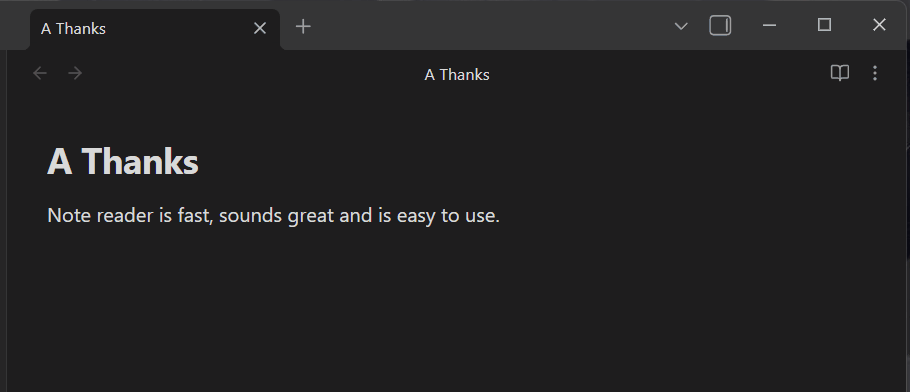

# Note Reader Plugin

## Purpose

Transform your notes (or articles via Obsidian Web Clipper) into an immersive audio experience with advanced text-to-speech technology. Enjoy high-quality customizable voices, real-time word highlighting, and convenient controls. Supports both online and on-device TTS for most devices.

## Table of Contents

- [Purpose](#purpose)
- [Features](#features)
- [Installation](#how-to-install-the-plugin)
- [Usage](#usage)
- [Mobile battery optimization](#mobile-battery-optimization)
- [Settings](#settings)
- [Commands](#commands)
- [Data security](#data-security)
- [Support and Contributing](#support-and-contributing)

## Features

### Reader

- **Text-to-Speech**: Read Obsidian notes aloud using high-quality voices with online (Azure Cognitive Services) or local (Web Speech API) TTS.
- **Reader Modes**: Enhanced mode with highlighting and progress tracking, and Lite mode for audio-only reading on mobile devices with the screen off.
- **Media Key Support**: Use keyboard media keys for playback control.
- **Resume Position**: Automatically remember and resume reading position (if enabled).

### Text Processing

- **Content Filtering**: Skip frontmatter, code blocks, tables, headers, inline code, tags, URLs, images, emojis, highlights, asterisks, underscores, and more.
- **Phrase Filtering**: Skip lines with custom phrases or stop on specific phrases.
- **File Name Announcement**: Optionally announce file name before content.

### Highlighting (enhanced mode only)

- **Word Highlighting**: Real-time highlighting of spoken words. Works in both Edit and Reading views. Research shows word-by-word highlighting improves [reading comprehension](https://pmc.ncbi.nlm.nih.gov/articles/PMC7959096/).
- **Guided Scrolling**: Auto-scroll to keep highlights visible and prevent editing during reading.
- **Highlight Themes**: Customizable visual themes for highlighting.

## How to install the plugin

1. **Community Plugins Store**: Open Obsidian, go to Settings → Community plugins → Browse, and search for "Note Reader". If available, select Install and then Enable. (Note: Plugin approval is taking several months, so if not found, use manual installation below.)
2. **Manual Installation**: Download the plugin files (`main.js`, `manifest.json`, `styles.css`) from the plugin's GitHub repository. Create a new folder in your Obsidian vault's plugins directory (e.g., `.obsidian/plugins/note-reader`). Place the downloaded files in this folder, then enable the plugin in Settings → Community plugins.

## Usage

To use Note Reader:

1. Open the note you want to listen to in Obsidian.

2. Activate the "Read note" command using one of these methods:
    - Press the assigned hotkey (if you've set one).
    - Click the ribbon icon.
    - Use the Command Palette and search for "Read note".

3. The reader controls will appear at the top of the current pane, showing a loading spinner while preparing the audio.

4. Use the controls to manage Note Reader:
    - **Play/Pause**: Toggle between reading and pausing the audio.
    - **Rewind**: Jump back 10 seconds.
    - **Settings**: Access the plugin settings.
    - **Close**: Stop reading and hide the reader interface.

5. If you switch to a different note while reading, click "Read Active Note" to restart reading from the beginning of the active note.

To assign a hotkey: Go to Settings → Hotkeys, search for "note reader", and assign a key combination to the "Read note" command.

## Mobile Battery Optimization

To avoid reader stopping on mobile devices, make sure to disable battery optimization for Obsidian:

- On Android, turn off battery optimization for Obsidian in the app settings.
- On iOS, disable Low Power Mode and enable Background App Refresh for Obsidian.

> **Why:** This permission allows continued reading in the background. Without it, Note Reader gets stalled shortly after the screen turns off on mobile devices.

More detailed instructions:

For Android (latest versions like Android 13 and 14):

- Open **Settings**.
- Go to **Apps & Notifications** > **See all apps** > **Obsidian**.
- Tap **Battery** or **Battery Optimization**.
- Select **Battery Optimization** or **Optimize battery usage**.
- Find Obsidian and set it to **Not optimized** or **Don’t optimize**.
- Alternatively, search **Battery Optimization** in Settings and exclude Obsidian.

For iOS (iOS 18 or 19):

- Open **Settings** > **Battery**.
- Turn off **Low Power Mode**.
- Enable **Background App Refresh** under **Settings** > **General** > **Background App Refresh** for Obsidian.
- Confirm Obsidian has permission to run in the background.

These steps prevent the system from pausing Obsidian when running in the background or with the screen off, ensuring uninterrupted reading. For battery-conscious users, Note Reader Lite mode is recommended when listening with the screen off.

## Settings

The plugin provides comprehensive settings accessible through Obsidian's settings panel.

### Basic Settings

- **Show ribbon icon**: Toggle to display the plugin's icon in the ribbon for quick access.
- **Reader mode**: Choose between Enhanced (visual progress with highlighting) or Lite (audio focused, designed for mobile).
- **Hotkey configuration**: Button to switch to the hotkey settings screen to assign shortcuts.

### Content Filters

Toggle various filters to exclude content from being read:

- Ignore YAML frontmatter
- Ignore fenced code blocks
- Ignore inline code backticks
- Ignore tags
- Ignore Markdown header syntax
- Ignore markdown tables
- Ignore highlight markers
- Ignore image embeds and attachments
- Ignore lines which look like links
- Ignore emojis
- Ignore asterisks
- Ignore backslash escapes
- Ignore underscores

Additionally, enable phrase line filtering to ignore lines containing specific phrases.

### Text-to-Speech

- **Provider**: Choose between Online (Azure Cognitive Services) or Local (browser's Web Speech API).
- **Voice**: Choose from available voices, grouped by locale with easy filtering by language and region.
- **Pitch**: -50 to +50 Hz
- **Speed**: 0.5x to 2.0x

### Audio File Generation

- **Storage location**: Choose where generated audio files are saved (Vault folder, Same folder as current file, Subfolder under current folder, or Specified folder).
- **Subfolder name**: Name for the subfolder when using subfolder storage option.

### Word Highlighting (Enhanced Mode Only)

- **Enable word highlighting**: Highlight words as they are spoken.
- **Locked scrolling**: Auto-scroll with highlighting and disable user interaction.
- **Scroll to highlight position on pause**: When paused, automatically scroll to the current highlight position.
- **Highlight theme**: Select a visual theme for highlighting.
- **Custom themes**: Create and manage your own highlight themes.

### Reading Behavior

- **Read file name before document**: Announce the file name before content.
- **Persist reading position**: Save and restore reading position in note frontmatter.
- **Rewind persisted positions**: Rewind slightly to provide context when resuming reading.
- **Always start from beginning when note is modified**: Skip the prompt when opening a note that has been modified since it was read.
- **When re-triggering read command** (Enhanced Mode Only): Choose what happens when you use the 'read note' command again while reading - pause/play, stop/start, or reload from beginning.
- **When re-triggering read command with a new note** (Enhanced Mode Only): Choose what happens when 'read note' is used on a different note while already reading.

### Reading Completion Behavior

- **Play chime**: Play a sound when reading finishes.
- **Automatically close player**: Close the reader UI on completion.
- **Stop reading phrase**: Stop reading when a specific phrase is found on its own line.

### Troubleshooting

- **Target buffer ahead**: How much audio to prepare in advance, in seconds. Higher values reduce interruptions but use more memory.
- **Read active note on load**: Automatically start reading on plugin load.
- **Enable debug logging**: Verbose logging for debugging.
- **Show estimated reading time**: Display estimated time to read to the right of the progress bar.

### Statistics

View usage statistics and reset counters.

## Commands

The plugin provides the following commands accessible via the Command Palette (`Ctrl+Shift+P` or `Cmd+Shift+P`), hotkeys, or the ribbon icon:

### Core Reading Commands

- **Read note or selected text**: Reads the active note aloud. If text is selected, reads only the selection. Otherwise, reads the entire note from the top (or from the persisted position if available).
  **Read from selected text**: Reads only the currently selected text. Only available when text is selected.
- **Start reading from cursor**: Begins reading from the current cursor position in the active note.
- **Reload active note**: Reloads and restarts reading of the currently active note from the beginning.

### Playback Control Commands

- **Toggle (pause or play)**: Pauses if currently playing, or resumes if paused.
- **Rewind 10 seconds**: Moves the playback position back by 10 seconds.
- **Stop and close**: Stops playback and closes the reader controls panel.

### Audio File Generation Commands

- **Generate audio file for current note**: Creates an audio file (MP3) for the currently active note. Requires online TTS provider.
- **Generate audio files for folder**: Opens a folder picker to select a folder and generates audio files for all markdown notes within it. Requires online TTS provider.

### Command Availability

> **Reference:** Reading commands require an active markdown or text file to be open. Playback controls are only available while actively reading. Audio file generation requires the online TTS provider (see [TTS Provider](#text-to-speech) in Settings).

### Hotkey Configuration

To assign custom hotkeys:

1. Go to **Settings** → **Hotkeys**
2. Search for "note reader" to see all available commands
3. Click the hotkey field and press your desired key combination

> **Note:** Not all commands may be available depending on the current state (e.g., playback controls are disabled when not reading).

## Data Security

The TTS system has two modes:

- **Local mode**: Uses the browser's Web Speech API (speechSynthesis) for client-side TTS, processing everything locally without sending data to external servers. This API may not be available on all platforms, including some Android devices.
- **Online mode**: Uses Azure Cognitive Services, which sends text and a token to Microsoft servers for processing. They state all data transfers are encrypted and data is deleted immediately after processing. See their [data policy](https://learn.microsoft.com/en-us/azure/ai-foundry/responsible-ai/speech-service/text-to-speech/data-privacy-security?tabs=custom-neural-voice) for more details.

**Voice Selection Dialog**: When using the voice selection dialog, country flags may be loaded from the network to display alongside voice options. If you prefer to avoid loading flags from the network, you can skip using the voice selection dialog and instead configure voices directly.

## Support and Contributing

For support, please check the [GitHub repository](https://github.com/mudnug/note-reader) for issues and discussions.